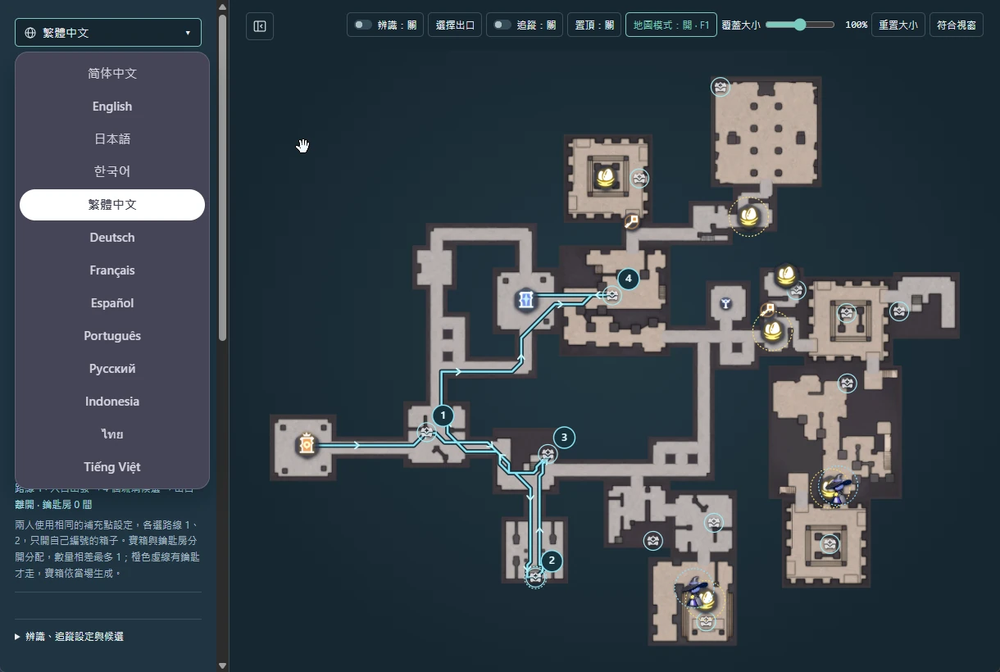
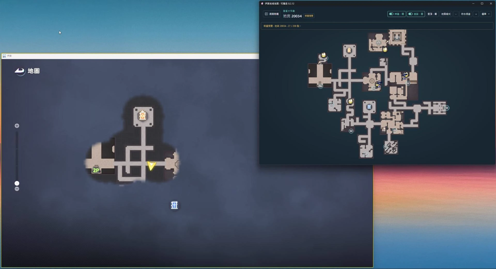
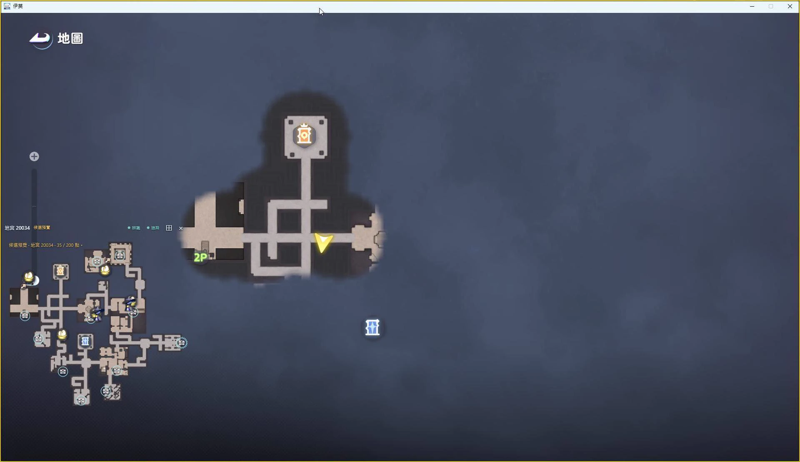
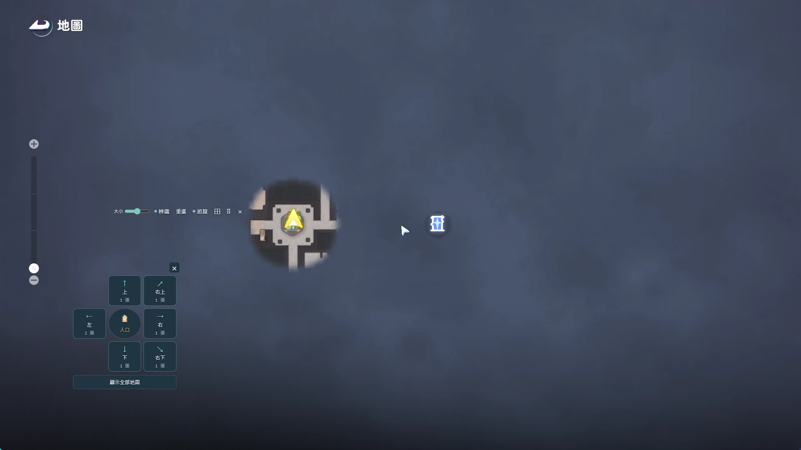

# 伊莫搶蛋地圖

**繁體中文** | [English](README.en.md)

伊莫「搶蛋大作戰」的 Windows 地圖工具，支援惡夢與混沌的 7 張地宮，提供寶箱／蛋巢標記、手動選圖、自動辨識、人物追蹤與透明覆蓋小地圖。

**[下載最新版 EXE](https://github.com/FCL2025/aniimo-dungeon-map/releases/latest/download/AniimoDungeonMap.exe)** · [版本更新與 ZIP 下載](https://github.com/FCL2025/aniimo-dungeon-map/releases/latest)

## 功能預覽

**1. 支援各國語言（13 種）**

**2. 範例圖 1：主視窗與遊戲地圖對照**

**3. 遊戲中的小地圖**

**4. 小地圖選擇出口**

圖 2、3 為舊版介面示意，實際按鈕與提示以最新版為準。

## 開始使用

1. 下載並執行 `AniimoDungeonMap.exe`，不需安裝；使用 ZIP 時請先完整解壓。
2. 在遊戲按 **M**，以入口為中心確認出口方向，再按工具的「選擇出口」。同方向有多張時，比對縮圖選擇；不確定可按「顯示全部地圖」。
3. 在側欄選擇難度與要顯示的標記，按「地圖模式」即可在遊戲上方顯示透明小地圖。
4. 進入下一場時，按小地圖上的「重選」重新選圖，不需回到主視窗。

辨識預設關閉。若要自動選圖，開啟「辨識」，並讓遊戲的 M 地圖保持縮到最遠；換場時將辨識關閉再開啟。開啟手動選圖會關閉辨識。

需要人物位置時，選好地圖後開啟「追蹤」，再關閉遊戲的 M 地圖、回到遊玩畫面。

側欄「遊戲解析度」支援 16:9（1920×1080、2560×1440，選 1920×1080）與 21:9（3440×1440）。設定會保存，變更後會重設辨識與人物追蹤；覆蓋小地圖在 1440p 時預設約 790×790。

## 常用操作

| 操作 | 功能 |
| --- | --- |
| **F1** | 隱藏／恢復覆蓋小地圖 |
| 滑鼠滾輪／拖曳地圖 | 縮放／平移地圖 |
| 拖曳小地圖上方的移動圖示 | 調整覆蓋位置 |
| 「覆蓋大小」／「重置大小」 | 調整小地圖尺寸／恢復預設 |
| 出口選單 **×／Esc** | 取消選擇，恢復原本地圖 |
| 側欄最上方的語言選單 | 切換語言，同步到覆蓋小地圖 |

雙人分工時，勾選「顯示最佳路徑」，兩人使用相同的「顯示房間模組補充點」設定，各選路線 1、2，只開自己的編號寶箱。橙色虛線需有鑰匙才走，金色寶箱未納入分工。

## 使用須知

- 支援 Windows 10／11 x64；辨識與追蹤需要 Windows 10 1903 以上。若缺少 [WebView2 Runtime](https://developer.microsoft.com/microsoft-edge/webview2/)，請先安裝。
- 遊戲建議使用視窗或無邊框模式；滑鼠被鎖住時先按 **Alt**。覆蓋地圖開啟後，主視窗可最小化。
- 更新前先關閉舊版；同一個 Windows 帳號會保留選圖、語言、路線與其他設定。
- 標記是候選位置，不保證每場生成，也不會自動記錄已開寶箱。辨識與追蹤仍可能受迷霧影響，目前不辨識樓層。

更多操作可查看側欄底部的「說明」。

側欄「顯示類型」上方的「金色道具拾取排名」可查看 24 種金色寶物的遊戲原始圖示、重量、售價與每單位重量價值。依售價／重量由高到低排列，同值並列；道具名稱隨語言切換，採用遊戲原文。
