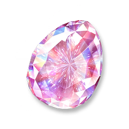
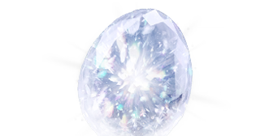

# 鑽石蛋展櫃藏品：不朽晶鑽蛋

解析日期：2026-09-26。來源：本機 `F:\Pawprint\Aniimo\game`，資源版本 `3595896`。

**截圖第一格的蛋形藏品對應「不朽晶鑽蛋」（Evercrystal Egg）。** 同一展櫃格接受一般款與「珍藏·不朽晶鑽蛋」。截圖仍顯示「未知藏品」，因此無法從這張截圖區分款式。

## 原始外觀

以下 PNG 直接從遊戲 Texture2D 解碼匯出，沒有重繪、改色或使用 AI 生成。

| 一般款：不朽晶鑽蛋 | 珍藏·不朽晶鑽蛋 |
| --- | --- |
|  |  |
| 白色透明切面，帶虹彩反光 | 粉紅色切面 |

展櫃清單使用的原圖：



## 判定依據

`egg_book_Collection_data[100101]` 提供完整對應：

- `sort = 1`：展櫃清單第一格。
- `name = 1183541336`：繁體本地化為「不朽晶鑽蛋」，英文為 `Evercrystal Egg`。
- `listImage = $ui_item_GrabEgg_Collection_Icon_DiamondEgg.png`。
- `lockModel = $P_Item_Props_DiamondEgg_Unlock.prefab`。
- `itemId = {5901301, 5900509}`：一般款與珍藏款共用這個展櫃位置。

雖然模型檔名包含 `Unlock`，資料表欄位明確叫做 `lockModel`；此處依欄位用途辨識為未取得時的展示模型。截圖中的淡藍色發光效果不應直接當成已取得藏品的配色。

同表後續排列也符合截圖中可見物品：

| 順序 | 展櫃 ID | 正式名稱 | 截圖比對 |
| --- | --- | --- | --- |
| 1 | 100101 | 不朽晶鑽蛋 | 蛋形未知藏品 |
| 2 | 100102 | 薔薇棘劍 | 紅玫瑰劍 |
| 3 | 100103 | 沐羽浮光 | 未知藏品輪廓，僅確認排列位置 |
| 4 | 100104 | 靈魂震音 | 紫綠耳機 |
| 5 | 100105 | 狼魂幽燈 | 藍色燈具 |
| 6 | 100106 | 雲絨眠夢 | 藍色睡帽 |
| 7 | 100107 | 龍焰號角 | 本截圖未顯示 |

截圖底部文字也能與繁體字典逐字對上：`2100954001` 為「未知藏品」，`1850508929` 為「尚未發現的一件未知藏品，有機率在「搶蛋大作戰」中探索獲得」。

## 道具與模型

| 款式 | 局內道具 ID | 帶出後 ID | 拾取物模型 |
| --- | ---: | ---: | --- |
| 不朽晶鑽蛋 | 5001301 | 5901301 | `P_Item_Props_DiamondEgg.prefab` |
| 珍藏·不朽晶鑽蛋 | 5000509 | 5900509 | `P_Item_Props_DiamondEgg_Pink.prefab` |

局內／帶出後對應由 `rob_egg_item_in` 和 `rob_egg_item_out` 雙向核對；`egg_book_antique_data` 再把兩個帶出後 ID 指回展櫃 `100101`。`collect_item_data` 確認拾取物模型。

模型的 Unity 資源目錄是 `Assets/Res/Prefab/Item/GrabEgg/`。上述模型與未取得模型均指向封包：

```text
F:\Pawprint\Aniimo\game\Aniimo_Data\cvs\res\uab\win\DefaultPackage\CacheBundleFiles\91\91c7ad7e67747af04d65610dea9d59d1\cdata.uab
```

也找到 Blue／Pink／Red 的圖示與模型。`rob_egg_collection_variant_model_data[1..3]` 與鑽石蛋淬煉資料有引用關係，但不能據此把截圖中的未取得模型直接認作藍色變體。

## 遊戲文字與取得資訊

道具描述：

> 堅硬無瑕的鑽石蛋，凝固著不再悸動的遠古生機。華光流轉不息，映照從亙古至永恆的漫漫時光。

用途文字確認這是可放入搶蛋大作戰藏品展櫃的藏品，並提及 S1 賽季限定伊莫飾品；飾品道具文字進一步寫明需在搶蛋大作戰中成功帶出對應藏品後解鎖。`item_source_data[717]` 寫的是「透過搶蛋大作戰玩法取得」。

這些是本機版本的靜態資源內容。本次確認藏品身分、圖示、道具轉換及模型引用，沒有建立特定地城、寶箱、座標或最終掉落率的證據。

## 匯出與重跑

- [完整證據 JSON](../exports/diamond-egg/evidence.json)：原始資料列、繁中／英文文字、9 張圖示來源、222 筆相關資源引用、封包位置與來源雜湊。
- [解析腳本](../scripts/extract_diamond_egg.py)。

```powershell
.\.venv\Scripts\python.exe -X utf8 scripts/extract_diamond_egg.py
```

腳本只讀取遊戲檔，輸出至 `exports/diamond-egg/`。已成功解碼 9 張 PNG，核對封包大小、唯一貼圖名稱、雙向道具對應與展櫃關係；一般款、珍藏款及展櫃清單原圖已目視檢查。
